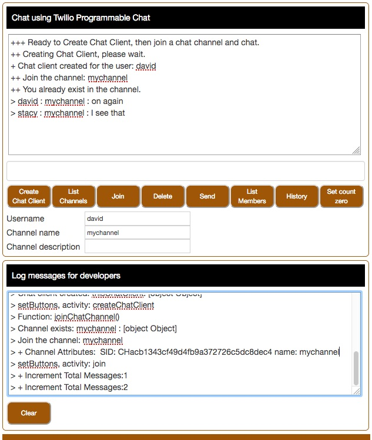

# PHP Chat Web Application

This application is ready to run.
To deploy to Heroku, you will need an [Heroku account](https://heroku.com/) to host your application.
Once you have an account, stay logged in for the deployment and configuration.

[](https://heroku.com/deploy?template=https://github.com/tigerfarm/tigchatphp)

When you deploy to Heroku, you will be prompted for an app name. 
The name needs to be unique. Example, enter your name+app (example: davidapp). 
Click Deploy app. You will be prompted for the following environment variables:
- ACCOUNT_SID : your Twilio account SID (starts with "AC", available from Twilio Console)
- CHAT_SERVICE_SID : your Chat service SID
- CHAT_API_KEY : your Chat API key
- CHAT_API_KEY_SECRET : your Chat API key secret

Note, you can manage the environment variables from the Heroku dashboard project Settings,
by clicking Reveal Config Vars.

Chat Client Application screen print:



### Requirements:

- Twilio account. A free Trial account will work.
- To run locally on your computer using the include web server, install Node.JS and the Twilio Node.JS helper library.

--------------------------------------------------------------------------------
## Twilio Console Configuration

These are the steps to configure to use the Chat Web Application.
No development or credit card information required to try Chat.

1. Create a Chat Service:

[https://www.twilio.com/console/chat/dashboard](https://www.twilio.com/console/chat/dashboard)

2. Create an API key and secret string:

[https://www.twilio.com/console/chat/runtime/api-keys](https://www.twilio.com/console/chat/runtime/api-keys)

--------------------------------------------------------------------------------
## PHP Application Files

- [index.html](index.html) : Chat client HTML
- [chat.js](chat.js) : Chat client JavaScript
- [custom/chat.css](custom/chat.css) : Chat client styles, CSS

- [generateToken.php](generateToken.php) : PHP program to generate Chat access tokens
- twilio-php-master : Twilio PHP helper library file directory

#### Heroku Deploying Files

- [webserver.js](webserver.js) : For localhost testing, a NodeJS Express HTTP Server that serves the Chat client files.
- [app.json](app.json) : Heroku deployment file to describe the application.
- [package.json](package.json) : Heroku deployment file which sets the programming language used.

#### Node Webserver for localhost testing

- [webserver.js](webserver.js) : For localhost testing, a NodeJS Express HTTP Server that serves the Chat client files.

--------------------------------------------------------------------------------
## For Developers

Following are the steps to run the Chat Web Application on your localhost computer.

Download this repository's zip into a working directory and unzip it.
Create an environment variable that is your Twilio Function Runtime Domain.
Example:
````
$ export ACCOUNT_SID ACxxx...xxx
$ export CHAT_SERVICE_SID ISxxx...xxx
$ export CHAT_API_KEY SKxxx...xxx
$ export CHAT_API_KEY_SECRET xxx...xxx
````
Run the Node.JS server program, install the required packages, then run the chat server or command line program.
````
$ npm install twilio
$ npm install twilio-chat
$ npm install express

$ node webserver.js
````
### Test the Chat Web Server
````
Use your browser to run the chat client:
http://localhost:8000
Enter a username, example: stacy.
Enter a Channel name and description, example: "mychannel" and "My test channel".

In another browser tab, run another chat client using a , same channel name:
http://localhost:8000
Enter a username, example: david (different username).
Enter a Channel name, example: mychannel (same as the other client).

Send messages between your clients.
````
--------------------------------------------------------------------------------
Cheers...
